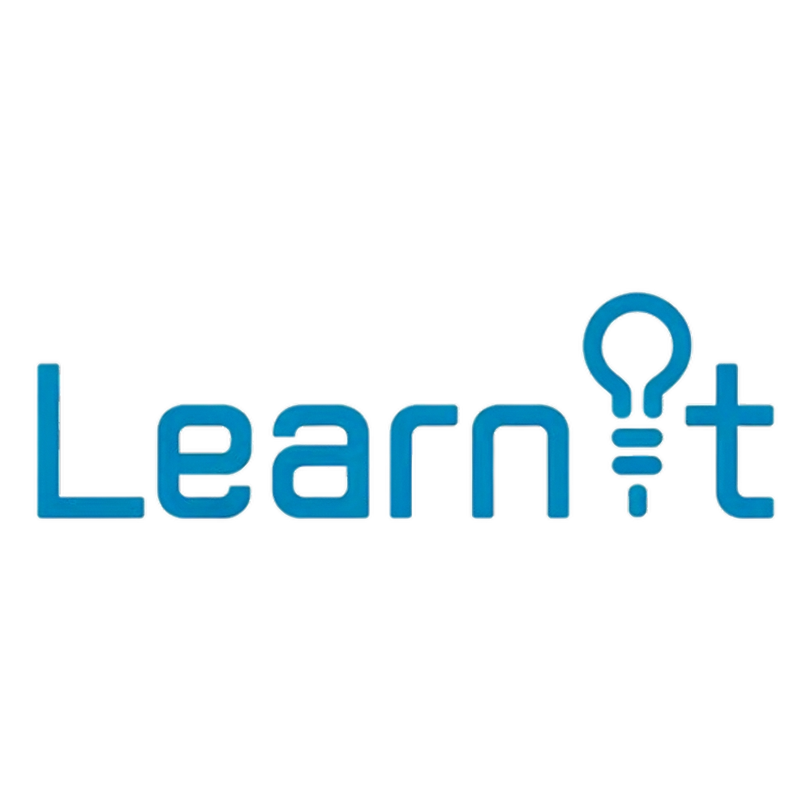

# LearnIT
A Learning platform for the Congressional App Challenge



# This Application was made for the:


# Description

What is this for?

This application is for people to learn about their favorite topics on an easy way.
By searching for courses and allowing people to interact with AI experts at this field
It also has the context of what is happening on the video and your progress on it

#How do i RUN IT?

Just simply run

```
./start.sh
```
thats it
